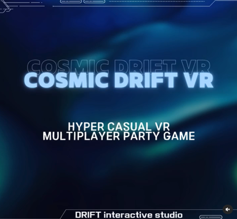
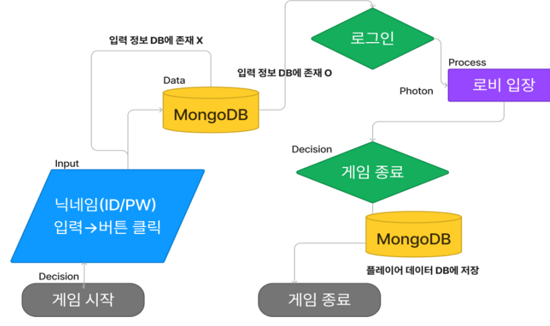
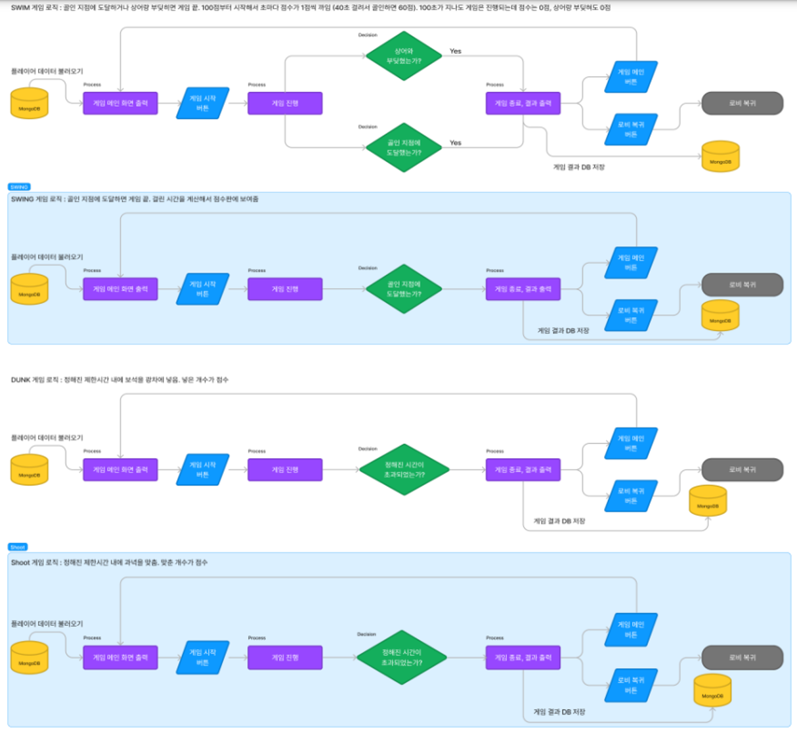

# 🚀 Cosmic Drift VR


## 💡 Project Overview
### About Project
`Cosmic Drift VR` is a hyper-casual genre party multiplayer game set in a fantastic space-themed environment, based on Meta Quest. Up to 4 players transform into space treasure hunters and compete in unique mini-game leagues across various planets.
### Project Objective
`Cosmic Drift VR` is a project that started with the desire to create the most approachable game to enjoy with friends, where you can jump right in without any preparation, much like sharing a bag of potato chips with the closest people when you want to spend a fun time together.

## 🛠️ Stacks
### 🌍 Environment
- **Platform** : Meta Quest 2 (via Oculus Integration)
- **Game Engine** : Unity 3D
- **XR Framework** : OpenXR (for cross-platfrom XR support)
- **Language** : C#
### ⚙️ Configuration
- **Version Control** : Unity Version Control
- **Build & Deployment** : Unity Build Settings for Meta Quest 2, Oculus Integration
- **Cloud Database** : MongoDB
### 💻 Development Tools
- **Code Editor** : Visual Studio
- **3D Modeling & Animations** : Blender
- **Networking** : Photon

## 🏗️ System Architecture



## 🔑 Key Features
<details>
  <summary>Log-In</summary>
  <ul>
    <li>Log in from your spaceship and enter the space station lobby (multiplayer)</li>
    <li>The spaceship serves as the player's My Home feature</li>
    <li>The player enters their ID using the VR keyboard to start the login process</li>
    <li>Demo Video : </li>
    <div>
      <a href="https://youtu.be/knwhoDrhb_o" target="_blank">
        
      </a>
    </div>
  </ul>
</details>

<details>
  <summary>Lobby</summary>
  <ul>
    <li>Implemented a maximum 4-player multiplayer system, designed a space station-themed lobby</li>
    <li>Players can network in the lobby, choose the game to start (host)</li>
    <li>Can access various additional content within the lobby</li>
    <li>Demo Video :</li>
    <div>
      <a href="https://youtu.be/_sk9ltuPHsI" target="_blank">
        
      </a>
    </div>
  </ul>
</details>

<details>
  <summary>Game Tournament 1 : Grab that Gem</summary>
  <ul>
    <li>Place gems into the cart to earn points</li>
    <li>Differentiated points awarded based on the type of gem</li>
    <li>Goal to score the most points within a limited time</li>
    <li>Player-specific score counting system</li>
    <li>Increased immersion through level design, including mine background and lava elements</li>
    <li>Demo Video :</li>
    <div>
      <a href="https://youtu.be/CsI4PM9UGDI" target="_blank">
        
      </a>
    </div>
  </ul>
</details>

<details>
  <summary>Game Tournament 2 : Treasure Hunt and Dive</summary>
  <ul>
    <li>Swimming movement through arm motions</li>
    <li>Avoid the shark chasing you in the ocean</li>
    <li>Tropical ocean level design</li>
    <li>Implement swimming with hand movements to minimize VR motion sickness</li>
    <li>Demo Video :</li>
    <div>
      <a href="https://youtu.be/JP0gz0W9Pn8" target="_blank">
        
      </a>
    </div>
  </ul>
</details>

<details>
  <summary>Game Tournament 3 : Shoot Them All</summary>
  <ul>
    <li>Shoot the target with a pistol to score points</li>
    <li>Adjust difficulty by generating new targets</li>
    <li>Palyer-specific score counting system</li>
    <li>Casual shooting competition system implemented</li>
    <li>Demo Video :</li>
    <div>
      <a href="https://youtu.be/XY4CeJY0hs8" target="_blank">
        
      </a>
    </div>
  </ul>
</details>

<details>
  <summary>Game Tournament 4 : Swing into the City</summary>
  <ul>
    <li>Pass through wires between tall buildings</li>
    <li>Reach the target point within the time limit</li>
    <li>Respawn and restart if falling off buildings</li>
    <li>Level design with city model and AI-based skybox generation for urban background</li>
    <li>Demo Video :</li>
    <div>
      <a href="https://youtu.be/R0i_oO_tQUg" target="_blank">
        
      </a>
    </div>
  </ul>
</details>

<details>
  <summary>Game Tournament 5 : Climb to the Sky</summary>
  <ul>
    <li>Climbing game where you grab and scale the building’s exterior</li>
    <li>Obstacles include meteors falling from the sky</li>
    <li>Score measured by how high you climb within the time limit</li>
    <li>If hit by a meteor, the grab is canceled and you fall</li>
    <li>Demo Video :</li>
    <div>
      <a href="https://youtu.be/pMY4h3Ujeqw" target="_blank">
        
      </a>
    </div>
  </ul>
</details>

## 💣 Troubleshooting

---
### 1️⃣ **VR Swimming Feature Implementation Issue**

When implementing the swimming mechanic in VR, the initial approach involved applying force in the opposite direction of the controller's movement using **Unity's physics engine** and the `Rigidbody.AddForce()` function to simulate the swimming motion. However, this approach led to several challenges.

#### **Issues Encountered**
---

- **Inconsistent Movement**:  
  The movement between the controller's actions and the physical response was **not smooth**. Small controller movements resulted in exaggerated or erratic physical reactions, making the swimming motion feel unrealistic and irregular.

- **Input Sensitivity**:  
  The input from the controllers was highly **sensitive**. Even the slightest hand movement would produce an excessive physical response, making the swimming motion **unnaturally fast**. This led to an uncomfortable and unbalanced experience for the player.

---
### **Solution Approach**
---

To solve the issue, the focus shifted to **optimizing the interaction between input and physics** for a more stable and controlled swimming experience. Instead of relying solely on raw physics-based force application, the solution incorporated **InputActionReference** for more precise input tracking and adjustments to the swimming force.

---
### **Solution Steps**
---

1. **Improved Input Handling with InputActionReference**:  
   The **InputActionReference** class was used to **precisely track the controller's movement**. By using **Unity's Input System**, we captured the **velocity** of the left and right controllers in **real-time**. This allowed for **fine-tuned input control**, ensuring that the swimming response is more consistent with the controller's movements.
     ```csharp
     var leftHandVelocity = leftControllerVelocity.action.ReadValue<Vector3>();
     var rightHandVelocity = rightControllerVelocity.action.ReadValue<Vector3>();
     Vector3 localVelocity = leftHandVelocity + rightHandVelocity;
     localVelocity *= -1;
    ```
   This approach reads the controller velocity and combines the movements of both hands to calculate **local velocity**, applying the necessary force in the opposite direction to simulate swimming.

2. **Force Application Optimization**:  
   To prevent **overreaction** to small movements, the force application was optimized by ensuring that force is applied only when the calculated velocity exceeds a certain threshold, which is defined by `minForce`. This prevents **minor hand movements** from triggering exaggerated physical reactions.
    ```csharp
    if (localVelocity.sqrMagnitude > minForce * minForce) {
      Vector3 worldVelocity = trackingReference.TransformDirection(localVelocity);
      _rigidbody.AddForce(worldVelocity * swimForce, ForceMode.Acceleration);
    }
    ```
   This method ensures that the force applied to the swimmer is proportional to the magnitude of the movement, avoiding erratic behavior and creating a more **realistic and controlled swimming experience**.

3. **Drag Force for Natural Resistance**:  
   To simulate the **resistance of water** and slow down the swimmer when no active input is detected, a **drag force** was introduced. This drag force **gradually decelerates the swimmer**, helping to smooth out the swimming motion and make it feel more natural.
    ```csharp
    if (_rigidbody.velocity.sqrMagnitude > 0.01f) {
      _rigidbody.AddForce(-_rigidbody.velocity * dragForce, ForceMode.Acceleration);
    }
    ```
   This drag force acts in the opposite direction to the swimmer's velocity, providing friction-like behavior that reduces speed over time.

---
### **Conclusion**
---
By combining **InputActionReference** for more accurate input tracking and optimizing the force application with Unity's physics engine, the issue of **input sensitivity** and **inconsistent movement** was resolved. The final implementation now provides a **smooth and responsive swimming experience** in VR, with **natural resistance** modeled by drag force. This solution creates a more immersive and comfortable swimming mechanic for users.


## 📄 Documents
- [Technical Report](./CosmicDriftVR_PDF/CosmicDriftVR_기술보고서.pdf)

## 🎮 In-Game Trailer Footage
[](https://youtu.be/JnEQsDqwAv0)

## 📥 Final Deliverable
You can download the final deliverable from the following link: [Download Final Deliverable](https://bit.ly/CosmicDriftVR)

